<!-- ====================== NEON / DARK HACKER ====================== -->

<a href="https://github.com/brucePedroGomes">
  
</a>

<div align="center">

[](https://brucegomes.com.br)

<a href="https://brucegomes.com.br"></a>
<a href="https://linkedin.com/in/brucepedrogomes"></a>
<a href="mailto:brucegomestech@gmail.com"></a>
<a href="https://wa.me/5544991738164"></a>


</div>

---

###  About me

```ts
const bruce = {
  role: "Senior Full-Stack Software Engineer · backend-focused",
  experience: "7+ years building and operating production systems",
  location: "Brazil 🇧🇷 · remote (UTC−3) · open to any country",
  currentlyAt: "Levva · sole backend engineer on the Corteva project (AWS serverless)",
  stack: ["Node.js", "TypeScript", "Python", "PostgreSQL", "AWS (serverless and containers)", "React"],
  architecture: ["Serverless", "Containers", "Event-driven", "Microservices", "DDD"],
  ai: "AI agents with tool use: a WhatsApp assistant on Amazon Bedrock, plus requirements-analysis and code-review agents (MCP)",
  practices: ["TDD", "Infrastructure as code", "CI/CD", "Code review"],
  website: "https://brucegomes.com.br",
  daily: "Arch Linux + Hyprland 🐧",
};
```

---

### 🧠 Tech Arsenal

#### Languages


#### Backend & APIs


#### Frontend


#### Cloud, DevOps & Data


#### AI / Agents


#### Linux life 🐧


---

### 📊 Stats

<!--
  These two cards are generated by .github/workflows/stats.yml, which runs
  stats-organization/github-readme-stats-action once a day and commits the
  SVGs to profile/. Nothing is fetched from a third-party server when someone
  views this page, so the cards cannot break with "Maximum retries exceeded"
  the way a shared hosted instance does.

  To change a card's look, edit the `options` query string in that workflow,
  then run it by hand: Actions -> "Generate Stats Cards" -> Run workflow.
  Option reference: https://github.com/stats-organization/github-stats-extended

  Note: count_private only counts private commits if `token:` is a personal
  access token with `repo` scope. With the default GITHUB_TOKEN it is ignored.
-->

<div align="center">





</div>

---

### 🐍 Watch the snake eat my contributions

<div align="center">

<picture>
  <source media="(prefers-color-scheme: dark)" srcset="https://raw.githubusercontent.com/brucePedroGomes/brucePedroGomes/output/github-snake-dark.svg"/>
  <source media="(prefers-color-scheme: light)" srcset="https://raw.githubusercontent.com/brucePedroGomes/brucePedroGomes/output/github-snake.svg"/>
  
</picture>

</div>

---

<div align="center">


</div>
